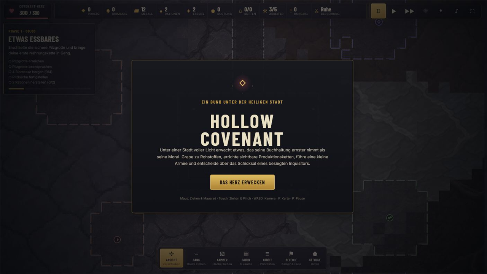
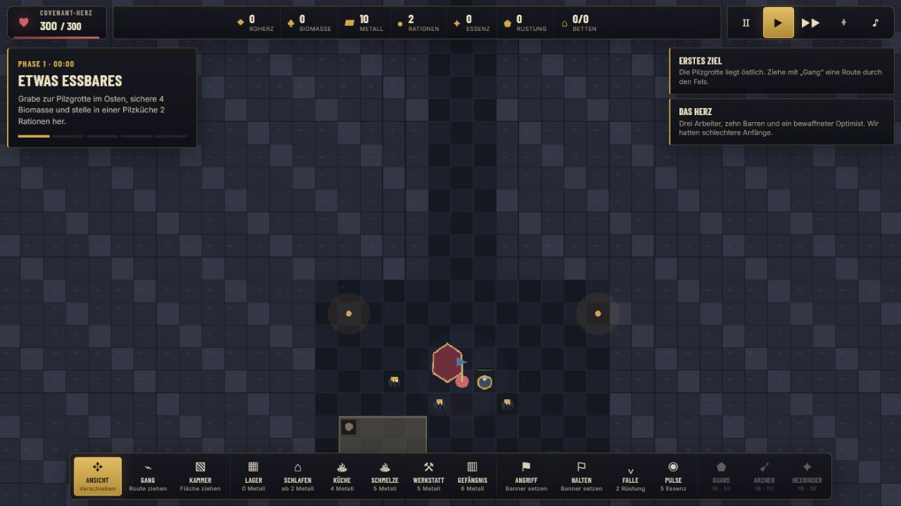
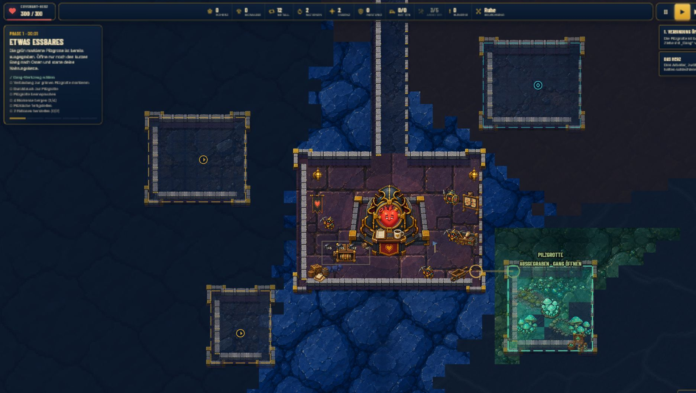
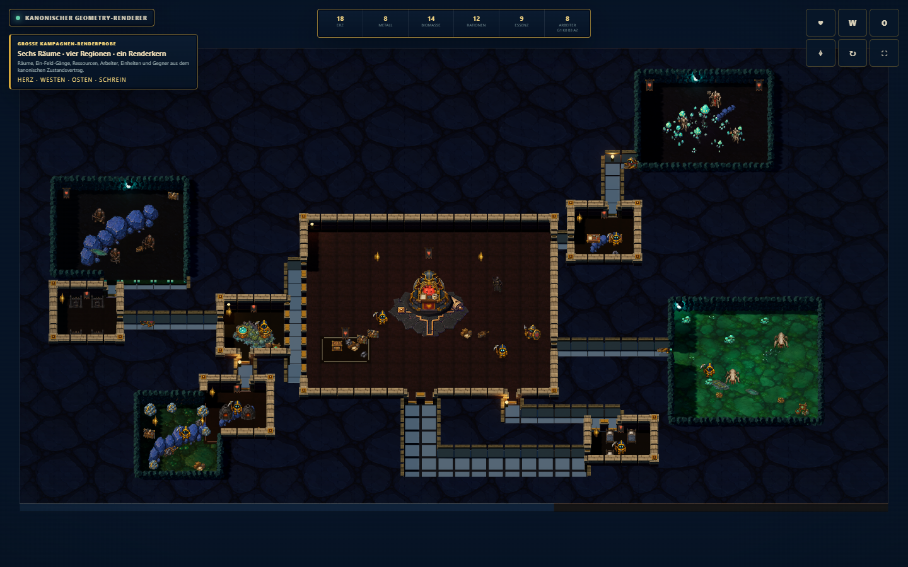

# Hollow Covenant

[](https://github.com/emfau88/Hollow/actions/workflows/deploy.yml)

<p align="center">
  <strong><a href="https://emfau88.github.io/Hollow/">▶ Hollow Covenant direkt im Browser spielen</a></strong>
</p>

**Hollow Covenant** ist ein spielbarer HTML5-Vertical-Slice eines humorvoll-makabren, mobile-tauglichen Dungeon-Management-Spiels. Unter einer angeblich heiligen Metropole erwacht ein uraltes Dungeon-Herz: Der Spieler gräbt ein unterirdisches Reich aus, erschließt Rohstoffe, organisiert sichtbare Produktionsketten, baut eine kleine indirekt gesteuerte Armee auf und entscheidet über das Schicksal besiegter Inquisitoren.

> **Projektstatus:** spielbarer Proof of Concept in aktiver Entwicklung. Zielplattformen sind Smartphone und Tablet im Querformat sowie Desktop-Browser. Grafik, Audio, Balancing und technische Architektur sind noch nicht auf finalem Produktionsniveau.

<p align="center">
  <a href="https://emfau88.github.io/Hollow/"></a>
  <a href="https://emfau88.github.io/Hollow/"></a>
</p>

### Experimentelle visuelle Richtung: Dungeon Administration

Style B überträgt das Spiel auf eine hellere, freundlichere und stärker
charakterbasierte Bildsprache. Der spielbare Startbereich verwendet bereits ein
mehrteiliges Herz-Hauptquartier, nichtmenschliche Covenant-Diener und eine
vollständig ausgestattete Pilzgrotte. Der bisherige Stil bleibt vorerst Standard.

<p align="center">
  <strong><a href="https://emfau88.github.io/Hollow/?theme=style-b">▶ Style-B-Slice direkt im Browser ausprobieren</a></strong><br /><br />
  <a href="https://emfau88.github.io/Hollow/?theme=style-b"></a><br />
  <small>Echter Spielscreen mit vergrößertem Herzraum, 2.5D-Wandbausatz, plastischen Böden und sichtbarer Pilzgrotte.</small>
</p>

### Spielbare 2.5D-Sandbox

Der neue Geometriepfad kann unabhängig vom bisherigen Renderer als mobile-first
Sandbox gespielt werden. Er verwendet echte 3D-Böden und -Wände, übernimmt aber
die sechs Raumtypen, Baukosten und Produktionsrezepte des Hauptspiels. Die große
Karte enthält mehrere ergiebige Eisen- und Pilzvorkommen und unterstützt freies
Ganggraben, Kammerplanung, zeitbasierte Arbeiteraufträge, maßstäbliche
Raumausstattung, Produktion und Touch-Bedienung. Hauptspiel und frühere
Prototyp-/Diagnoseseiten bleiben als getrennte Einstiege erhalten.

<p align="center">
  <strong><a href="https://emfau88.github.io/Hollow/geometry-sandbox.html">▶ Spielbare 2.5D-Sandbox öffnen</a></strong><br />
  <small>Smartphone/Tablet: Querformat empfohlen. Gang per Tippen/Ziehen; Kammern und Räume als Fläche aufziehen.</small>
</p>

Die technischen Hintergründe und der beschlossene Migrationspfad stehen in der
[Renderer-Entscheidung](docs/GEOMETRY_RENDERER_DECISION.md).
Der getrennte optische Abnahmestand ist im
[Style-B Visual-Truth-Gate](docs/STYLE_B_VISUAL_TRUTH_GATE.md) dokumentiert.
Die verbindliche Zustandsarchitektur, große Kampagnen-Renderprobe und die daraus
abgeleitete Assetentscheidung stehen in der
[kanonischen Geometry-Integration](docs/CANONICAL_GEOMETRY_INTEGRATION.md).

### Kanonische Kampagnenintegration

Das bisherige Hauptspiel (`GameScene`) ist der alleinige kanonische
Spielzustand. Der neue Three.js-Renderer liest seine Karte, Räume, Waren,
Arbeiter, Truppen, Gegner und Ziele über `AutomationState-v1`; fehlende
Kampagnenfunktionen werden nicht mehr in einem Sandboxmodell nachgebaut.

- `spatial-prototype.html` startet eine echte Hauptspielinstanz, pausiert deren
  Frameschleife und rendert ihren kanonischen Zustand mit exakt demselben
  Geometry-Modul wie die Visual-Truth-Szene.
- `spatial-prototype.html?campaign-evaluation=1` zeigt eine große
  schreibgeschützte Kampagnen-Renderprobe desselben Zustandsvertrags mit sechs
  Raumtypen, Kreuzungen, Ressourcen, Einheiten und Gegnern.



`geometry-sandbox.html` bleibt als historischer, spielbarer
Präsentationsproof erhalten. `spatial-prototype.html` besitzt dagegen keinen
zweiten Renderer mehr; der frühere Spatial-Renderpfad wurde entfernt.

### Technischer Stand des eingefrorenen 2.5D-Proofs

Die Sandbox ist ein **spielbarer Architektur- und Gameplay-Proof**, aber kein
zweiter Produktpfad und kein Ersatz für den vollständigen Vertical Slice.
Nachgewiesen ist:

- echte Boden- und Wandgeometrie wird aus offenen Feldern erzeugt; Geraden,
  Innen-/Außenecken, T-Stücke und Kreuzungen benötigen keine überlappenden
  Komplettsprites mehr;
- die Wanddarstellung unterscheidet inzwischen automatisch zwischen gebauter
  Architektur und natürlichem Fels: organische Felskörper schließen Gangränder,
  während Räume topology-getriebene Pfeiler, Kappen, Messingbänder und
  Übergangsschwellen erhalten;
- ein sparsames Beleuchtungsset setzt warme Covenant-Wandleuchten und kühle
  Naturlichter als emissive 3D-Körper mit echten lokalen Lichtquellen. Die Zahl
  der Lichter wird auf Mobilgeräten niedriger gehalten;
- drei Arbeiter sind von Beginn an sichtbar. Frisch gegrabene Felder bleiben
  zunächst roh und werden anschließend als eigene priorisierbare Arbeitskette
  Feld für Feld beansprucht; Boden und Randarchitektur wechseln dabei sichtbar
  von Natur zu Covenant;
- die Startkammer enthält ein kleines, bereits fertiges Lager. Funktionsräume
  besitzen dezente, raumtypische Farbakzente statt eines dicken einheitlichen
  Goldrahmens; das Lager verwendet keine unpassende Felsreihen-Dekoration mehr;
- Claiming ist nicht mehr zeitgesteuert unsichtbar: Ein zweiter Arbeiter läuft
  über das echte Wegenetz zum nächsten claimbaren Feld, arbeitet dort sichtbar
  und löst erst danach den Boden- und Wandwechsel aus. Weitere Arbeiter suchen
  reale Bau-, Abbau- oder zusätzliche Grabziele statt dekorativ zu kreisen;
- vier vorbereitete neutrale Orte existieren von Beginn an als echte, vom
  Dungeon getrennte Kammern mit eigenem Boden, geschlossenen Wänden und realen
  Ressourcenvorkommen: zwei Pilzgrotten, eine Eisengalerie und ein altes
  Vorratsgewölbe. Sie sind keine Bilder auf grabbaren Felsfeldern. Erst ein vom
  Dungeon aus gegrabener Durchbruch verbindet und entdeckt sie; anschließend
  werden sie Feld für Feld beansprucht. Die getrennten Kammern können weder als
  entfernter Startpunkt für Grabaufträge benutzt noch einfach durchgraben werden;
- Pilzvorkommen und fertige Funktionsräume verwenden kuratierte Kompositionen
  aus vorhandenen Style-B-Assets, Boden-Decals, Licht, Randintarsien und
  asymmetrisch verteilten Requisiten statt gleichförmig gestapelter Symbole;
- die geschlossene Karte besitzt nun eine hellere, reliefartige Felsdecke aus
  mehreren günstigen Form-, Höhen-, Farb- und Texturvarianten statt einer
  dunklen, sichtbar gekachelten Texturmatte. Ressourcenregionen sind
  wie im Hauptspiel schon vor dem Durchbruch über geologische Farbzonen,
  einzelne lesbare Vorkommensmarker und sichtbare Landmark-Kammern erkennbar;
- die Pilzgrotte und eine neue, direkt aus den Style-B-Zielbildern abgeleitete
  Erzmine bilden zwei bewusst komponierte Hero-Orte mit eigenen Lichtfarben,
  Boden-Decals, Requisiten und klarer Ressourcensilhouette;
- Erz und Pilze bleiben trotz der großen Environment-Komposition echte
  einzelne Lagerstätten: Ein Arbeiter läuft zum Vorkommen, spielt dort seine
  Arbeitsanimation, entnimmt eine Einheit und trägt ein sichtbares Bündel zum
  Dungeon-Herz beziehungsweise in ein fertiges Lager. Erst die Ablieferung
  erhöht den Bestand; erschöpfte Hotspots verschwinden aus der Szene;
- die Pilzgrotte bildet nun einen ersten vollständigen vertikalen Gameplay-Loop:
  Der Durchbruch entdeckt einen sichtbaren Höhlenkriecher, ein vorhandener
  Covenant-Wächter läuft über das echte Wegenetz zur Grotte und bekämpft ihn.
  Solange der Gegner lebt, kann der Grottenboden nicht beansprucht werden. Nach
  dem Kampf claimen Arbeiter den Ort, bauen Pilze ab und tragen Biomasse ins
  Lager;
- eine fertige Pilzküche verwendet für diesen Loop keine direkte globale
  Bestandsumrechnung mehr. Ein Arbeiter nimmt Biomasse sichtbar aus dem Lager,
  liefert sie an den Kücheneingang, die Station erzeugt nach Arbeitszeit einen
  sichtbaren Rationsstapel und ein Arbeiter bringt eine Ration zur hungrigen
  Covenant-Kreatur. Ein kompaktes HUD-Ziel zeigt die sieben nachgewiesenen
  Schritte von Entdeckung bis Fütterung;
- bei jeder tatsächlichen Lagerlieferung erscheint ein deutliches, kurzlebiges
  HUD-Popup mit Art und Menge der eingelagerten Ressource. Die seitlichen
  Arbeiterframes werden abhängig von der realen Bewegungsrichtung gespiegelt;
- Grabaufträge öffnen den Fels nicht sofort: Der sichtbare Arbeiter läuft zum
  exakt angrenzenden Feld, richtet sich zum Ziel aus und beendet dort erst seine
  Grabanimation samt Fortschrittsanzeige;
- große 48 × 32-Karte, umfangreiche Erz- und Pilzvorkommen, sechs Raumtypen,
  Baukosten, Raumgrößen, Kapazitäten und die drei Produktionsrezepte des
  Hauptspiels funktionieren in einer fortlaufenden Sandbox;
- Arbeitsprioritäten verteilen Graben, Bauen und Abbau; Geometrie und
  Ressourcen werden ereignisbasiert statt in jedem Frame vollständig neu
  aufgebaut;
- mobile Steuerung mit mindestens 44 px großen Zielen, kompakter
  Ressourcenleiste, unterer Werkzeugleiste, aufklappbaren Bau-/Arbeitsmenüs,
  Pinch-Zoom, Vollbild und einer bestmöglichen Querformat-Anforderung ist
  vorhanden. Eine erzwungene Bildschirmdrehung bleibt von Browser und Gerät
  abhängig; insbesondere iOS kann sie verweigern.

Noch klar fehlend oder vereinfacht sind:

- vollständige Übernahme der Kampagne mit Fog of War, allgemeiner physischer
  Logistik für alle Raumrezepte, Bedürfnissen für mehrere Kreaturen,
  steuerbaren Kampfverbänden, Fallen, Rekrutierung, Wellen,
  Gefangenenablauf, Sieg/Niederlage und Speichern. Kampf, Hunger und
  Produktionslogistik sind bislang bewusst nur im beschriebenen Pilzgrotten-
  Loop nachgewiesen;
- vollständig individuelle Fortschrittsberechnung für den Raum-Bau. Graben,
  Claiming sowie Ressourcenabbau und -transport sind bereits an die Ankunft
  konkreter Arbeiter gebunden; der Raum-Bau wird am korrekten Ziel visualisiert,
  sein Fortschritt läuft intern aber noch über die zusammengefasste Simulation;
- dieselbe robuste Jobreservierung, Weg-Neuberechnung und Fehlerbehandlung wie
  im Hauptspiel sowie echtes Geräte-QA auf mehreren Smartphones und Tablets;
- finale 3D-/2.5D-Assets, Animationen, Effekte, Audio, Balancing und ein
  durchgängiger visueller Qualitätsdurchlauf.

#### Warum die Sandbox noch spartanisch aussieht

Der Prototyp sollte zuerst die zuvor problematische **Topologie, Verdeckung und
Interaktion** beweisen. Natürlicher Fels, Claim-Übergänge, Pilzlandschaften und
Raumkompositionen sind inzwischen vorhanden, bleiben aber ein erster
Art-Direction-Pass: Ein Teil der Ausstattung ist weiterhin eine Mischung aus
perspektivischen Sprites und einfacher Geometrie, Oberflächen wiederholen sich
noch sichtbar und Animation, Schatten sowie atmosphärische Effekte sind nicht
auf Mockup-Niveau. Der verbleibende Abstand ist damit vor allem eine Frage von
konsistentem Asset-Maßstab, Materialtiefe und Szenenkomposition – nicht erneut
das alte Ecken-/Kantenproblem des Renderers.

Die große kanonische Kampagnenprobe zeigt inzwischen genauer, welche Hebel für
Mockup-Nähe verbleiben:

1. modulare Dressingsets und Bodendecals für alle sechs Raumtypen;
2. regionale Rand-, Geröll- und Decalsets für Eisenkammer, Zwergenposten und
   Schrein;
3. die verbleibenden 64-Pixel-Truppen und Gegner auf die Detailstufe der neuen
   96-Pixel-Figuren bringen;
4. Grab-, Bau-, Produktions- und Kampfeffekte sowie wenige lokale
   Atmosphäreninseln;
5. finales HUD-Icon- und Typografieset.

Die vorhandenen hellgrauen Wandflächen sind dafür bereits geeignet. Eine neue
Wandfamilie oder längere/stärkere Schatten sind derzeit ausdrücklich kein
priorisierter Assetbedarf.

## Vision

Der Vertical Slice soll eine zentrale These beweisen:

> Strategisches Graben und eine sichtbare Wirtschaft erzeugen militärische Macht; der Umgang mit Gefangenen bestimmt zugleich, welche Gesellschaft unter der Erde entsteht.

Die sechs Designpfeiler sind:

1. **Strategisches Graben** zu sichtbaren Rohstoff-, Raum- und Konfliktzielen.
2. **Sichtbare Wirtschaft** mit physischen Gütern und Transportwegen.
3. **Wirtschaft erzeugt Militärmacht** durch Einheiten, Fallen und Expansion.
4. **Indirekte Führung** über Prioritäten, Banner und autonome Einheiten.
5. **Gefangene verbinden Kampf und Moral** mit konkreten spielmechanischen Folgen.
6. **Lesbarkeit vor Systemmenge**: Voraussetzungen und Stillstände sollen verständlich sein.

Die vollständige Produktvision, Zielerfahrung und Definition of Done stehen im [Masterplan](Hollow_Covenant_Masterplan.md).

## Was bereits spielbar ist

- handgebaute Untergrundkarte mit 64 × 48 Feldern, Fog of War und mehreren Geologieregionen;
- Gang- und Kammerplanung, feldweises Graben, Beanspruchen und Errichten von Räumen;
- autonome Arbeiter mit persistentem Jobboard, Reservierungen und einstellbaren Arbeitsprioritäten;
- physische Rohstoffe, sichtbarer Transport, Lagerkapazitäten sowie blockierbare Raum-Ein- und -Ausgänge;
- drei Produktionsketten: Biomasse → Rationen, Roherz → Metall und Metall → Rüstungsgüter;
- sechs Raumtypen: Lager, Schlafkammer, Pilzküche, Schmelze, Werkstatt und Gefängnis;
- drei reguläre Kampfeinheiten sowie ein rekrutierbarer Inquisitor;
- Angriffsbanner, Haltebanner, Bolzenfallen, Covenant-Puls, Hunger und Heilung in Betten;
- natürliche Ressourcen, Zwergen-Claim, Essenzschrein und drei Inquisitionswellen;
- fünfteilige Missionsführung mit Checklisten, Freischaltungen, Sieg und Niederlage;
- geführter Ersteinstieg mit sichtbar ausgegrabener Pilzgrotte, markierter Tunnelverbindung und schrittweise freigeschaltetem HUD;
- Gefangenenablauf mit Eskorte, Zelle und den Entscheidungen Freilassen, Rekrutieren oder Opfern;
- Vertrauen und Furcht mit Auswirkungen auf Armee, Ressourcen und Finalwelle;
- responsives HUD, Querformat-Sperre, Vollbildmodus, Touch-Steuerung sowie Pause, 1× und 2× Geschwindigkeit.

Die Mission ist als kompakter Durchlauf mit einer Zielgröße von etwa 8–10 Minuten angelegt. Es gibt bewusst keinen Sandbox-Modus.

## Kernschleife

```text
Ziel wählen → Tunnel planen → Arbeiter graben und beanspruchen
     ↓
Rohstoff abbauen → sichtbar transportieren → verarbeiten
     ↓
Räume, Kämpfer und Fallen finanzieren → Standort erobern
     ↓
Gefangenenentscheidung treffen → Finalwelle überstehen
```

## Schnellstart

Voraussetzungen:

- Node.js 22
- npm

```bash
git clone https://github.com/emfau88/Hollow.git
cd Hollow
npm ci
npm run dev
```

Danach `http://localhost:5188/` öffnen.

### Produktionsversion lokal prüfen

```bash
npm run build
npm run preview
```

Die Vorschau läuft standardmäßig unter `http://localhost:4188/`.

## Steuerung

### Maus und Tastatur

| Eingabe | Aktion |
|---|---|
| Ziehen | je nach aktivem Werkzeug Kamera bewegen, Gang/Kammer planen oder Raum aufziehen |
| Mausrad | zoomen |
| `WASD` / Pfeiltasten | Kamera bewegen |
| `F` | bekannte Karte einpassen |
| `P` | Pause ein-/ausschalten |
| `R` | Knick einer geplanten L-Gangroute drehen |
| `Esc` | zum Kamerawerkzeug wechseln |

Weitere Aktionen wie Geschwindigkeit, Vollbild, Audio, Covenant-Puls, Arbeitsprioritäten, Bau, Rekrutierung und Kampfsteuerung sind direkt über das HUD erreichbar.

### Erste Schritte und Arbeiter

Nach dem Erwecken des Herzens ist die **Pilzgrotte östlich der Starthöhle bereits ausgegraben und grün markiert**. Wähle „Gang“ und ziehe die kurze Verbindung vom goldenen Ring bis zum grünen Ring. Die Arbeiter graben und beanspruchen den neuen Boden automatisch. Baue danach eine Pilzküche und versorge sie mit Biomasse.

Zusätzliche Arbeiter werden nach einer **fertigen Pilzküche** freigeschaltet. Klicke oben im HUD direkt auf den Arbeiterzähler (`3/5`); ein Arbeiter kostet 2 Essenz, benötigt 4 Sekunden und das aktuelle Limit liegt bei 5. Kämpfer erscheinen später separat unter „Gefolge“.

### Touch

- im Querformat spielen;
- mit einem Finger je nach Werkzeug ziehen;
- mit zwei Fingern verschieben und per Pinch zoomen;
- Kartenansicht, Vollbild und Simulationsgeschwindigkeit über das HUD steuern.

## Entwicklung

| Befehl | Zweck |
|---|---|
| `npm run dev` | Vite-Entwicklungsserver auf Port 5188 |
| `npm test` | alle Vitest-Tests einmal ausführen |
| `npm run test:watch` | Tests im Watch-Modus |
| `npm run lint` | strikte TypeScript-Prüfung ohne Ausgabe |
| `npm run build` | TypeScript prüfen, Vite-Build erzeugen und Sites-Paket vorbereiten |
| `npm run preview` | Produktionsbuild lokal auf Port 4188 starten |

Der optionale Diagnosemodus ist unter `http://localhost:5188/?debug=1` verfügbar. Er zeigt Simulations- und Arbeiterdaten und bietet Abkürzungen für wiederholbare QA-Szenarien.

### Browser-Automation und Chromium-Agenten

Der explizite Automationsmodus läuft unter `http://localhost:5188/?automation=1&seed=42`. Er deaktiviert automatische Vollbildwechsel, verwendet einen reproduzierbaren Zufallsseed und installiert nach dem Laden `window.hollowAgent`. Die API steuert dieselben Spielaktionen und Sperrregeln wie das sichtbare HUD:

```js
const agent = window.hollowAgent;
agent.start();
agent.getState();
agent.planDig({ x: 38, y: 34 }, { x: 42, y: 34 });
agent.setSpeed(2);
agent.step(100);
agent.focusTarget('fungus');
```

Verfügbare Methoden: `start`, `getState`, `selectTool`, `planDig`, `placeRoom`, `summonWorker`, `recruit`, `setSpeed`, `step`, `focusTarget` und `reset`. `getState()` liefert Mission, Checkliste, Ressourcen, Arbeiter, Einheiten, Gegner, Räume, Gegenstände, bekannte Felder, Weltziele, Kamera und blockierte Aktionen als serialisierbares Objekt. Für ereignisgesteuerte Runner stehen `hollow:agent-ready`, `hollow:action-complete` und `hollow:objective-changed` bereit. Wichtige HUD-Elemente besitzen zusätzlich stabile `data-testid`-Selektoren; zugängliche Weltziel-Schaltflächen spiegeln die sichtbaren strategischen Ziele.

## Technik und Projektstruktur

- **Engine:** Phaser 3.90.0
- **Sprache:** TypeScript 5 mit aktiviertem Strict Mode
- **Build:** Vite 7
- **Tests:** Vitest 3
- **Darstellung:** WebGL/Canvas mit DOM-/CSS-HUD
- **Simulation:** fester 10-Hz-Takt, Rendering bis 60 FPS
- **Deployment:** statischer Build über GitHub Actions/GitHub Pages; zusätzlich Sites-kompatible Paketierung

```text
src/
  config/   Balancewerte, Terrain- und Missionskonfiguration
  core/     Regeln, Pathfinding, Jobboard, Terrain und Audio
  data/     Räume, Einheiten, Gegenstände und Rezepte
  scenes/   Phaser-Spielszene und Laufzeitorchestrierung
  ui/       DOM-basiertes HUD
tests/      Regel-, Missions-, Job-, Wirtschafts- und Pfadtests
public/     Laufzeit-Assets
scripts/    reproduzierbare Asset- und Deployment-Aufbereitung
docs/       QA-, Asset-, Imagegen- und Änderungsdokumentation
```

Bei jedem Push auf `main` installiert der GitHub-Actions-Workflow die Abhängigkeiten, prüft TypeScript, führt die Tests aus, baut die Anwendung und ist für das anschließende GitHub-Pages-Deployment konfiguriert.

## Projektdokumentation

- [Masterplan](Hollow_Covenant_Masterplan.md) – Produktvision, Scope, Systeme und Definition of Done
- [Changelog](docs/CHANGELOG.md) – bisherige Entwicklungsschritte
- [QA-Bericht](docs/QA_REPORT.md) – automatisierte und manuelle Prüfungen
- [Asset-Manifest](docs/ASSET_MANIFEST.md) – aktive und verworfene Grafikassets
- [Imagegen-Log](docs/IMAGEGEN_LOG.md) – dokumentierte Generierungen und lokale Aufbereitung
- [Visual Style B](docs/VISUAL_STYLE_B.md) – Style Bible, Produktionsregeln und Freigabekriterien
- [Renderer-Entscheidung](docs/GEOMETRY_RENDERER_DECISION.md) – Wandproblematik, Testergebnis und 2.5D-Migrationspfad
- [Laufender Hollow-Audit](docs/HOLLOW_COVENANT_AUDIT.md) – geprüfter Ist-Stand, umgesetzte Auditpunkte und offene Architekturentscheidungen

## Bewusste Grenzen des Vertical Slice

Der aktuelle Scope enthält unter anderem keine prozeduralen Karten, mehrere Ebenen, Oberflächenwelt, Forschung, Handel, Multiplayer, Konten, Backend, Monetarisierung oder ein umfangreiches Savegame-System. Die Oberfläche ist derzeit deutschsprachig. Audio und Grafik dienen dem Proof of Concept und sind nicht als finale Release-Assets zu verstehen.

## Lizenz

Aktuell ist keine Lizenzdatei im Repository hinterlegt. Nutzung, Weitergabe oder Wiederverwendung von Code und Assets ist damit nicht pauschal freigegeben.
