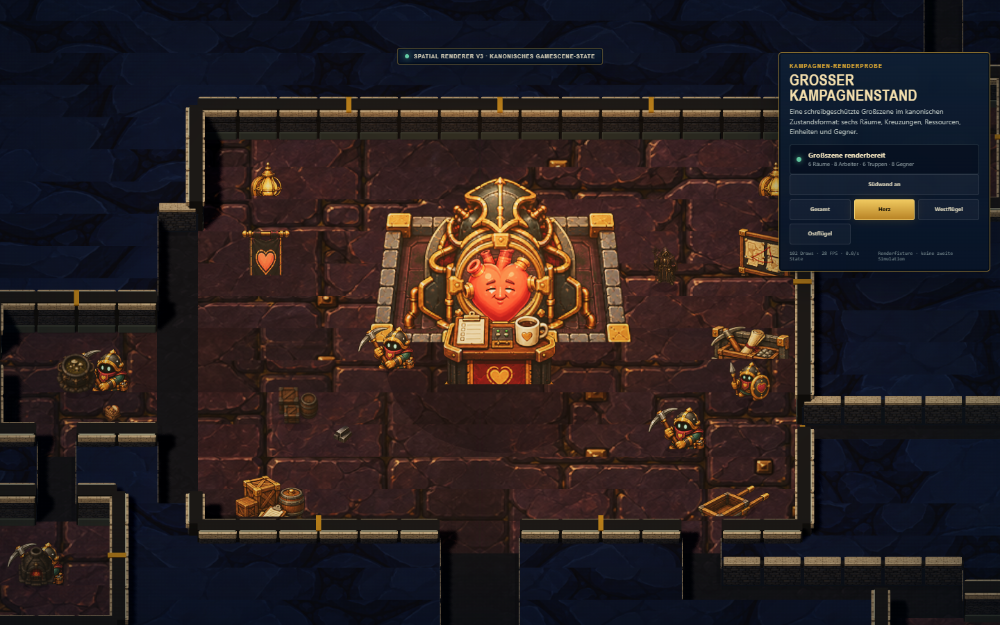
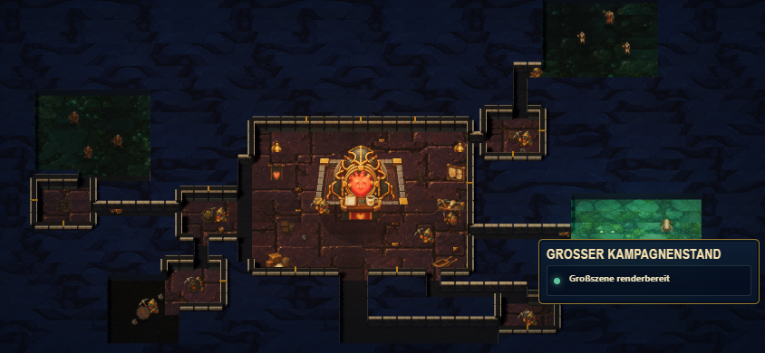
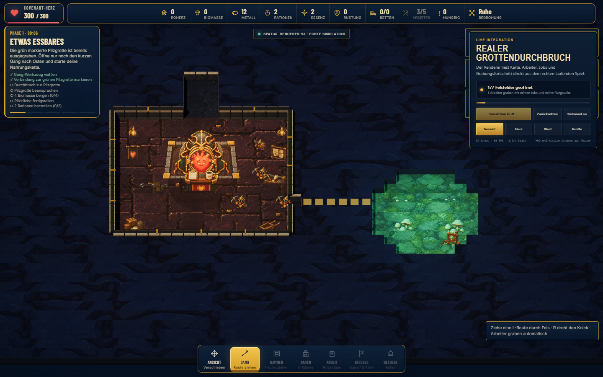

# Kanonische Geometry-Integration

Stand: 5. August 2026

## Verbindliche Architekturentscheidung

`GameScene` ist der alleinige Eigentümer des Spielzustands und aller
Spielregeln. Seine renderer-neutrale Projektion `AutomationState` Version 1 ist
der kanonische Vertrag für alternative Renderer. An Renderergrenzen wird dafür
der sprechende Alias `CanonicalGameState` verwendet.

```text
GameScene (Regeln und Zustand)
        │
        ▼
AutomationState / CanonicalGameState
        │
        ▼
Three.js-Geometry-Renderer
```

`GeometrySandboxModel` bleibt als historischer, spielbarer Präsentationsproof
erhalten, ist aber ausdrücklich eingefroren: Dort werden keine fehlenden
Kampagnenfunktionen mehr ergänzt oder nachgebaut. Neue Spielfunktionen entstehen
nur in `GameScene` und werden anschließend über den kanonischen Vertrag sichtbar.

## Zwei Prüfmodi desselben Renderers

- `spatial-prototype.html`: Live-Integration. Eine verborgene echte
  Hauptspielinstanz liefert ihren Zustand; der Three.js-Renderer zeigt ihn und
  der Grottendurchbruch läuft mit echten Jobs und echter Wegsuche.
- `spatial-prototype.html?campaign-evaluation=1`: große, schreibgeschützte
  Renderfixture im exakt selben Zustandsformat. Sie enthält sechs Raumtypen,
  Ein- und Zweifeldgänge, T-/Kreuzungen, vier Kampagnenregionen, Ressourcen,
  acht Arbeiter, sechs Truppen und acht Gegner. Sie enthält keinerlei Tick- oder
  Gameplaylogik und ist daher keine zweite Simulation.

Die Fixture wird erst erzeugt, nachdem die echte Brücke `AutomationState-v1`
geliefert hat. So prüft der Einstieg zugleich, dass der Renderer weiterhin am
Hauptspielvertrag hängt.

## Übertragene Präsentation

- Kamera: orthografisch, etwa 53 Grad über der Horizontalen;
- Licht: ACES bei Exposure 1,0, gerichtetes Key-Light 3,25 gegenüber Ambient
  0,22 und Hemisphere 0,72;
- Schatten: gerichtete Schatten auch mobil (512er Map), kurze Kontaktschatten
  mit 0,20 Deckkraft;
- Fels: 0,76 Einheiten hohe geschlossene Masse ohne Normalfels-Emission und
  ruhige zusammenhängende Style-B-Oberfläche;
- Wände: helle Mauertextur, getrennte Sockel-/Fassaden-/Kappenlagen,
  sparsame Messingklammern;
- Einfeldgänge: volle sichtbare Laufbreite, hohe Rückwand, niedrige
  Vorderwange und seitlich abgestufte Wandhöhe;
- Sprites: gemeinsame Bodenanker, normalisierte sichtbare Höhe und einheitliche
  kurze Kontaktschatten für Arbeiter, Truppen, Gegner, Waren und Raumprops.

## Visueller Prüfstand








Die automatisierte Browserprüfung bestätigt:

- `AutomationState-v1` wird verbunden;
- die verborgene Phaser-Frameschleife schläft;
- Großszene: 6 Räume und 22 Akteure;
- Live-Integration: Startknopf aktiv und reales erstes Grabfeld geöffnet;
- Desktop 1440 × 900 und Mobil 844 × 390 rendern ohne Seitenfehler.

## Assetentscheidung nach der Großszene

Die vorhandenen hellgrauen Wandflächen sind geeignet. Neue Wandbilder sind
aktuell **nicht** der größte Hebel; Topologie, Fassadenlesbarkeit und kurze
Schatten funktionieren bereits in der großen Szene.

Für Mockup-Nähe fehlen, in dieser Reihenfolge:

1. **Modulare Raum-Dressingsets:** mehrere kleine, zusammenpassende Props und
   Bodendecals je Küche, Schmelze, Werkstatt, Schlafkammer, Lager und Gefängnis.
   Ein einzelnes Symbol pro Raum macht die Funktion in der Übersicht noch nicht
   eindeutig genug.
2. **Regionale Höhlenränder und Decals:** Eisenkammer, Zwergenposten und Schrein
   verwenden derzeit farblich angepasste vorhandene Böden. Eigene kleine Sets
   aus Randgeröll, Rissen, Erzadern, Pilzbewuchs und Kultmarken würden die
   rechteckigen Kampagnenkammern organischer und voneinander unterscheidbar
   machen.
3. **Konsistente Restfiguren:** Arbeiter, Wächter und Bogenschütze besitzen die
   neuere 96-Pixel-Familie; Hexbinder, Inquisitor und Gegner stammen noch aus
   der älteren 64-Pixel-Familie. Für Nahansichten braucht diese Gruppe eine
   gemeinsame Detailstufe, Perspektive und Alpha-Ausnutzung.
4. **Aktions- und Atmosphäreneffekte:** Grabstaub, Bauimpulse, Produktionsglut,
   Trefferfeedback und wenige lokale Nebel-/Lichtinseln. Die Grundbeleuchtung
   selbst muss dafür nicht erneut umgebaut werden.
5. **Finales HUD-Set:** vereinheitlichte Icons und Typografie nach Abschluss der
   Welt-Assets; im mobilen Querformat ist die Fläche bereits ausreichend klein.

Bis diese vier Welt-Assetgruppen vorliegen, sollte keine weitere Wand- oder
Rendererfamilie begonnen werden.
