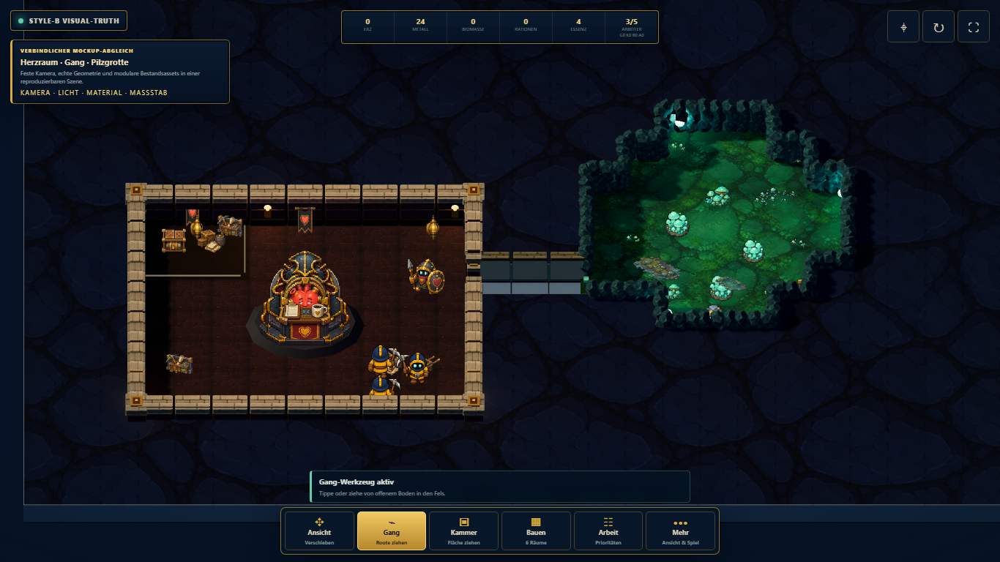
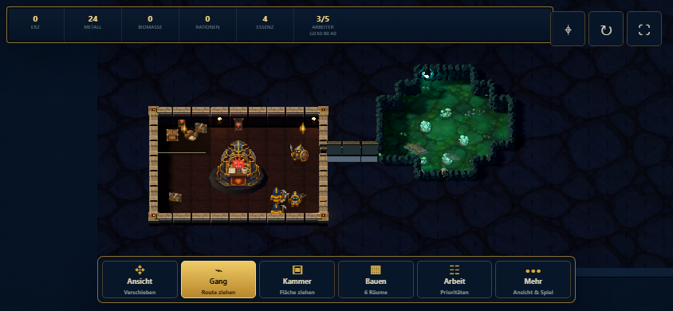

# Style-B Visual-Truth-Gate

Stand: 5. August 2026

## Zweck

Diese Szene ist bewusst **kein zweites Spiel**. Sie friert einen kleinen Zustand
der 2.5D-Sandbox ein, damit Kamera, Maßstab, Wandgeometrie, Materialien,
Beleuchtung und Mobile-Lesbarkeit direkt mit den Style-B-Mockups verglichen
werden können. Die bisherigen spielbaren Fassungen bleiben unverändert.

Start: `geometry-sandbox.html?visual-truth=1`

## Was jetzt nachgewiesen ist

- Wände, Innen-/Außenecken und Durchgänge entstehen aus echter Geometrie statt
  aus überlappenden Komplettbildern.
- Ein kompakter Herzraum, ein gebauter Gang und eine organische Pilzgrotte
  funktionieren in derselben Szene und im selben Figurenmaßstab.
- Nahtlose, mockup-nahe Fels- und Grottenmaterialien funktionieren auf der
  Geometrie, ohne für jede Ecke ein eigenes Bild zu benötigen.
- Vorhandene Figuren-, Herz- und Dekorassets können mit dem neuen Renderer
  gemischt werden.
- Der Ausschnitt bleibt im mobilen Querformat lesbar; die HUD wird dort auf die
  obere Ressourcenleiste und die untere Werkzeugleiste reduziert.

## Ehrliches Ergebnis

Der **technische Weg ist bestätigt**. Das alte Ecken-/Kantenproblem ist kein
grundsätzliches Hindernis mehr. Die Szene trifft bereits Palette, Grundstimmung,
Raum-Gang-Grotte-Komposition und Leuchtkontrast der Zielbilder.

Der Architekturpass ist abgeschlossen. Der Herzraum verwendet jetzt eine
modulare Style-B-Wandfamilie aus getrennten Sockeln, zwei Fassadenlagen,
einzelnen Kappensteinen, unterschiedlich behandelten Innen-/Außenecken und
Covenant-Pfeilern. Der Gang besitzt bewusst niedrigere Wangen; gebaute und
natürliche Übergänge haben eigene offene Schwellen. Dafür wurde keine weitere
Renderer- oder Assetfamilie angelegt.

Die Visual-Truth-Kamera steht nun bei rund 53 Grad über der Horizontalen. Das
zeigt deutlich mehr von den Wandfassaden als die vorherige, fast top-down
gerichtete Einstellung, ohne Bodenfläche oder Figuren hinter der Vorderwand zu
verbergen.

Der Integrationspass für bestehende Figuren und Props ist ebenfalls
abgeschlossen. Arbeiter und Wächter werden anhand ihrer sichtbaren
Alpha-Silhouetten statt anhand der sehr unterschiedlichen 96-Pixel-Leerflächen
skaliert. Bodengebundene Figuren, Wagen, Vorräte, Regale, Pilze und die
Grottenstation verwenden jetzt feste untere Anker und kurze, einheitliche
Kontaktschatten. Die mehrteilige Herzarchitektur behält bewusst ihren
gemeinsamen Mittelpunkt, weil ihre vier Ebenen sonst im Tiefentest auseinander
fallen würden.

Ein **pixelgenauer Mockup-Nachweis ist noch nicht erreicht**. Gegenüber den
Mockups fehlen weiterhin:

1. dichteres, gezielt platziertes Herzraum-Dressing und kleinere erzählerische
   Requisiten;
2. die finale Lichtstimmung mit weichen lokalen Lichtinseln, besserem
   Umgebungslicht und dezenter Farbkorrektur;
3. die endgültige HUD-Typografie und Iconqualität.

## Nachfolgende Integration

Die Präsentation dieses kleinen Gates wurde inzwischen auf den bereits mit dem
echten Hauptspiel verbundenen Three.js-Renderer übertragen. `GameScene` ist
schriftlich und technisch als kanonischer Zustand festgelegt; die große
Kampagnen-Renderfixture benutzt denselben `AutomationState-v1`-Vertrag und keine
zweite Simulationslogik.

Großszene, Browser-QA und die jetzt belastbare Assetpriorisierung sind in der
[kanonischen Geometry-Integration](CANONICAL_GEOMETRY_INTEGRATION.md)
dokumentiert. Dieses kleine Gate bleibt als reproduzierbarer Detailvergleich
für Herzraum, Einfeldgang und Pilzgrotte bestehen.
